# Lawyer Experience - Visual Flow Diagrams

## 1. Overall System Architecture


---

## 2. Lawyer's Email Experience

```mermaid
sequenceDiagram
    participant Sender
    participant EmailSystem
    participant Lawyer
    participant WebApp

    Sender->>EmailSystem: Send diagnostic invitation
    Note over EmailSystem: Generates secure token<br/>Valid for 7 days

    EmailSystem->>Lawyer: Email delivered to inbox
    Note over Lawyer: Subject: "Optimize Your Legal Practice"

    Lawyer->>Lawyer: Opens email

    Note over Lawyer: Email Contents:<br/>• Personalized greeting<br/>• Description of benefits<br/>• "Start Your Assessment" button<br/>• Secure link (one-time use)<br/>• Expiration notice (7 days)

    Lawyer->>WebApp: Click assessment link
    Note over WebApp: Validates token<br/>Creates session

    WebApp->>Lawyer: Welcome page
    Note over Lawyer: Asks for name to begin

    Lawyer->>WebApp: Enter name & start
    WebApp->>Lawyer: Question 1 of 20
```



---

## 3. Question Flow with AI Guidance


---

## 4. Report Generation Flow


---

## 5. Sample Lawyer Experience Timeline


---

## 6. Individual Question Screen Layout

```mermaid
graph TB
    subgraph "Browser Window"
        A[Header: Practice Optimization Diagnostic] --> B[Progress: Question 5 of 20 (25%)]

        B --> C[Question Category: Document Drafting]
        C --> D[Question Number: 5]

        D --> E[Question Text Box]
        E --> F["How do you currently draft routine legal documents (motions, pleadings, discovery requests)?"]

        F --> G[Option Selection Area]

        subgraph "4 Option Cards (Vertically Stacked)"
            H[Card 1: Start from scratch<br/>Score: 1/4] --> G
            I[Card 2: Some templates<br/>Score: 2/4] --> G
            J[Card 3: Smart templates<br/>Score: 4/4] --> G
            K[Card 4: Custom input<br/>"Other (please specify)"<br/>Text box appears when selected] --> G
        end

        G --> L[Navigation Buttons]
        L --> M[Previous (if not Q1)]
        L --> N[Next (enabled when option selected)]

        G --> O[AI Guidance Panel (Highlighted)]
        O --> P["💡 AI Guidance: This question helps identify..."]
        O --> Q["Key considerations: Think about your typical week..."]
        O --> R["Examples: If you frequently reuse document language..."]

        style E fill:#fff9c4,stroke:#333,stroke-width:2px
        style G fill:#f5f5f5,stroke:#333
        style O fill:#e8f5e9,stroke:#2e7d32,stroke-width:2px
        style K fill:#ffecb3,stroke:#f57c00
    end
```

---

## 7. Report View Layout

```mermaid
graph TB
    A[Report Header: Practice Optimization Report] --> B[Personalized for: Lawyer Name]

    B --> C[Score Summary Cards]
    subgraph "Top Section: Key Metrics"
        D[Card 1: Optimization Grade<br/>C+ (68%)] --> C
        E[Card 2: Time Savings<br/>8.0 hours/week] --> C
    end

    C --> F[Category Breakdown Chart]
    subgraph "Category Scores (Progress Bars)"
        G[Intake: ████████░░ 56%] --> F
        H[Documents: ███████░░░ 50%] --> F
        I[Case Mgmt: ███████░░░ 50%] --> F
        J[Billing: ████████░░ 58%] --> F
        K[Admin: █████████░ 67%] --> F
    end

    F --> L[Quick Wins Section (Highlighted in Green)]
    subgraph "Immediate Actions (This Week)"
        M[1. Create Email Templates<br/>Save 1-2 hrs/week | Easy | $0] --> L
        N[2. Document Templates<br/>Save 2-3 hrs/week | Easy | $0] --> L
        O[3. Time Tracking App<br/>Save 1-2 hrs/week | Easy | $0] --> L
    end

    L --> P[Detailed AI-Generated Report]
    subgraph "Full Analysis (Scrollable)"
        Q[Executive Summary] --> P
        R[Category Analysis] --> P
        S[Prioritized Recommendations] --> P
        T[30-60-90 Day Roadmap] --> P
        U[Cost/Benefit Analysis] --> P
    end

    P --> V[Action Buttons]
    subgraph "Next Steps"
        W[📥 Download Report] --> V
        X[📅 Schedule Consultation] --> V
    end

    style D fill:#ffeb3b,stroke:#333
    style E fill:#4caf50,stroke:#333
    style L fill:#c8e6c9,stroke:#2e7d32,stroke-width:3px
    style P fill:#f5f5f5,stroke:#333
```

---

## 8. Data Flow (What Happens Behind the Scenes)


---

## 9. Mobile Experience Layout

```mermaid
graph TB
    subgraph "Mobile Phone View (Vertical)"
        A[Header with Logo] --> B[Progress Bar (Thin)]

        B --> C[AI Guidance Panel (Collapsible)]
        C --> D["💡 Tap for help..."]

        D --> E[Question Text Area]
        E --> F["How do you track deadlines?"]

        F --> G[Scrollable Options]
        subgraph "Stacked Cards (Tap to Select)"
            H[Option A<br/>Paper calendar] --> G
            I[Option B<br/>Digital calendar] --> G
            J[Option C<br/>Practice management] --> G
            K[Option D<br/>Other (specify)] --> G
        end

        G --> L[Next Button]
        L --> M[Bottom Navigation]

        M --> N[⬅️ Previous]
        M --> O[💾 Save & Exit]

        style G fill:#f5f5f5,stroke:#333
        style L fill:#667eea,stroke:#333,color:#fff
        style C fill:#e8f5e9,stroke:#2e7d32
    end
```

---

## 10. Email Template Structure (What Lawyer Sees)

```mermaid
graph TB
    A[Email Container] --> B[From: Practice Optimization Diagnostic]

    B --> C[Subject: Optimize Your Legal Practice - Personalized Analysis]

    C --> D[Header Section]
    D --> E[Large Title: "Transform Your Practice"]
    D --> F[Subtitle: "AI-Powered Optimization for Litigation Attorneys"]

    F --> G[Personal Greeting]
    G --> H["Hi {Lawyer Name},"]
    G --> I["{Your Name} has invited you to complete a Practice Optimization Diagnostic"]

    I --> J[Benefits Box (Blue Background)]
    J --> K[✓ Personalized Analysis]
    J --> L[✓ Save 5-10+ Hours/Week]
    J --> M[✓ AI-Guided Questions]
    J --> N[✓ Action Roadmap]

    N --> O[Call-to-Action Button]
    O --> P["🚀 Start Your Assessment (10-15 minutes)"]

    P --> Q[Link Box (Yellow Background)]
    Q --> R[Secure Link: https://.../diagnostic/{token}]
    Q --> S["⏰ Expires in 7 days"]

    S --> T[Footer]
    T --> U[Questions? Reply to this email]
    T --> V[Contact: {Your Name}]

    style J fill:#e3f2fd,stroke:#1976d2,stroke-width:2px
    style O fill:#667eea,stroke:#333,color:#fff
    style Q fill:#fff9c4,stroke:#f57f17
```

---

## Key User Experience Highlights

### What Makes This Effective for Lawyers:

1. **Low Friction**: Email → Click → Start (no registration required)
2. **AI Guidance**: Each question has helpful context and examples
3. **Progress Saving**: Can exit and return later (24-hour session)
4. **Mobile-Friendly**: Works on phone, tablet, or desktop
5. **Clear ROI**: Quantified time savings in hours/week
6. **Actionable**: Specific recommendations, not just generic advice
7. **Professional**: Clean, modern interface that builds trust
8. **Secure**: One-time links that expire after 7 days

### Typical Time Investment:

- **Email reading**: 30 seconds
- **Starting assessment**: 1 minute
- **Answering questions**: 10-15 minutes
- **Reviewing report**: 5-10 minutes
- **Total time**: ~20 minutes for comprehensive practice analysis

### What Lawyer Gets at the End:

- Optimization grade comparing their practice to benchmarks
- Specific hours they can save per week (quantified)
- Quick wins they can implement this week
- Short-term improvements (30-60 days)
- Long-term strategic changes (90+ days)
- Cost estimates for each recommendation
- Priority ranking (what to do first)
- Downloadable report for reference
